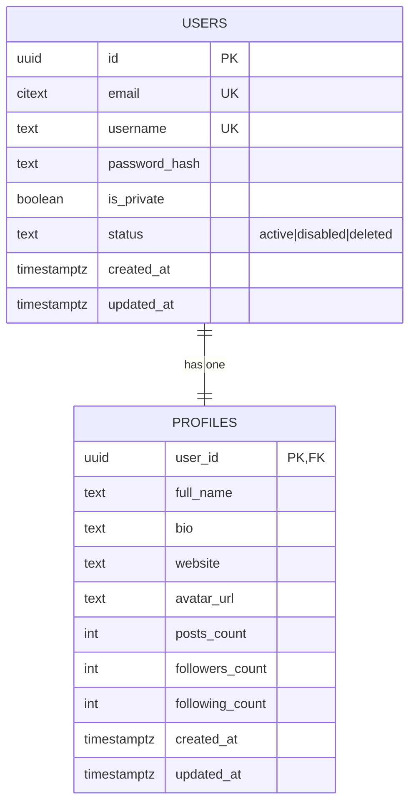
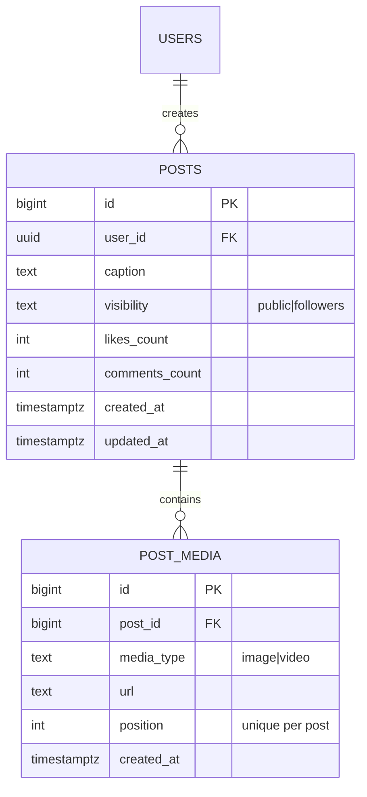
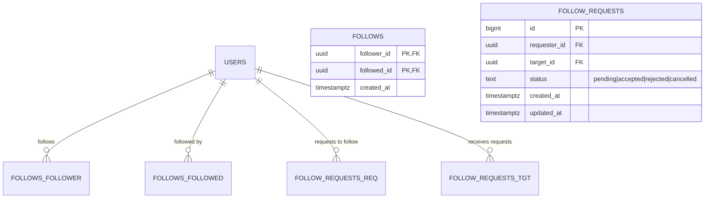
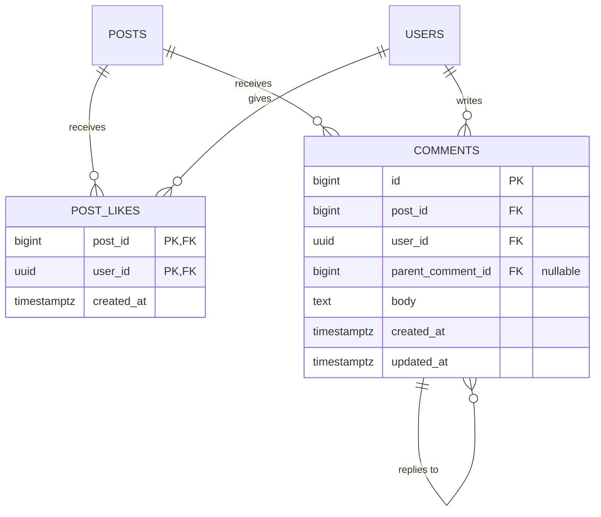
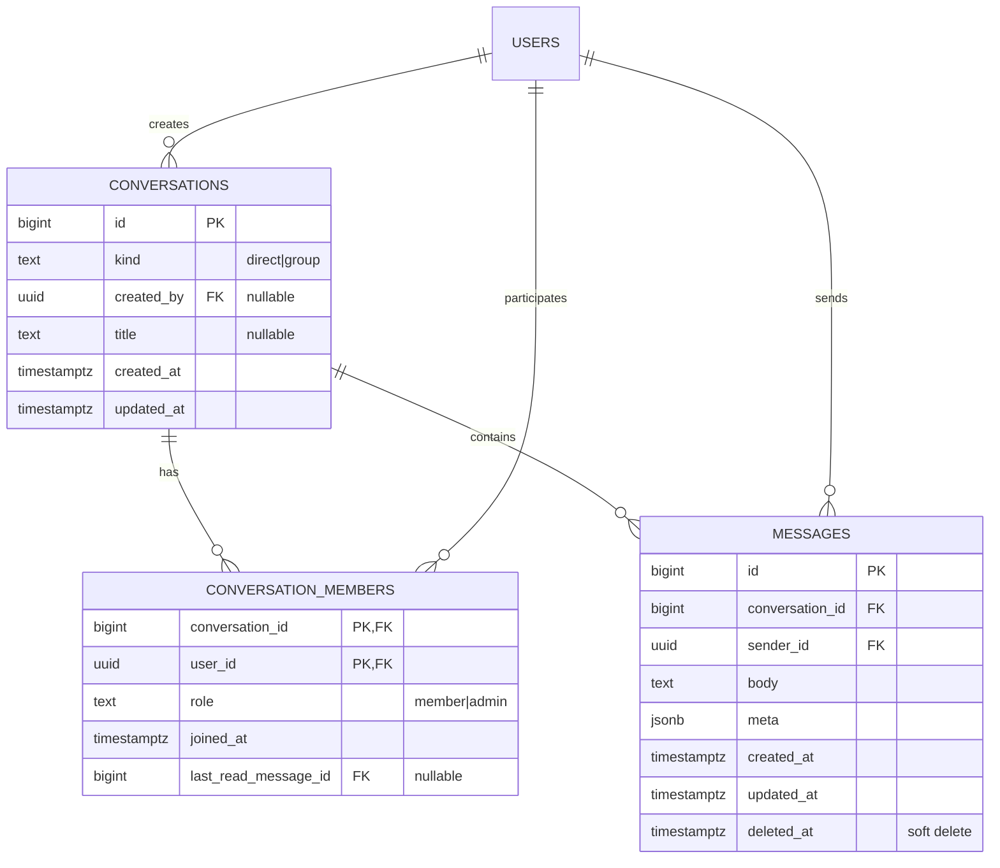
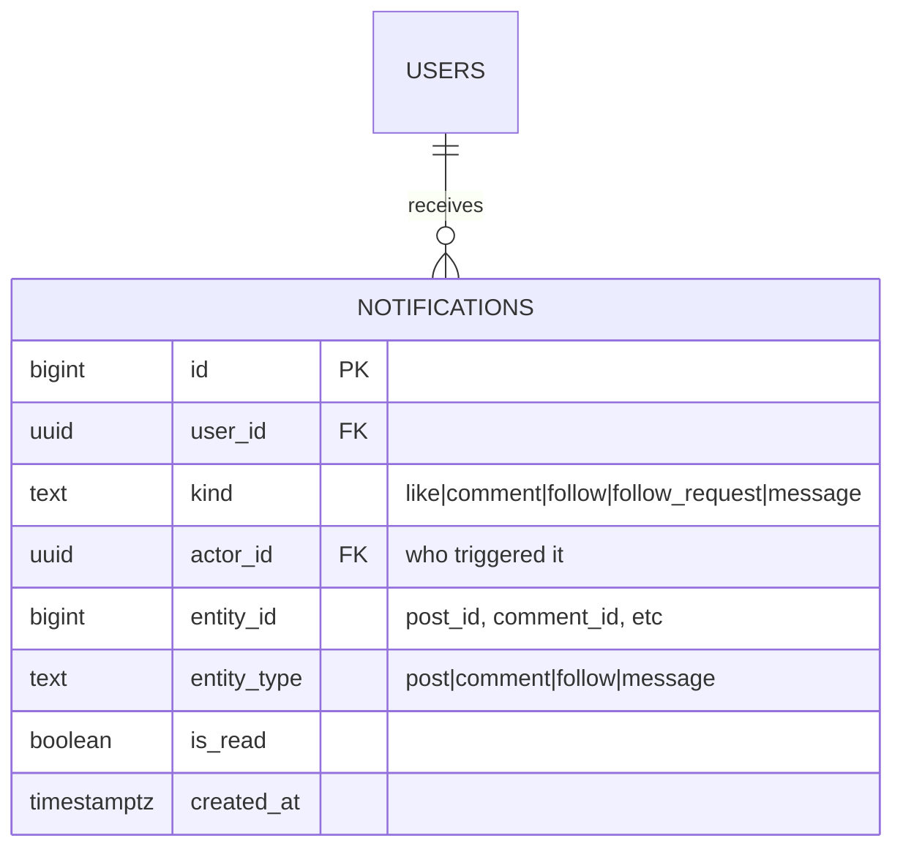
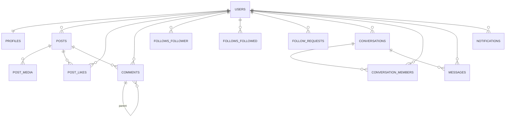
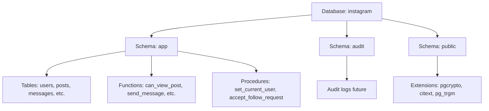

# 📐 Schema Diagrams

This document provides visual representations of the database schema using Entity-Relationship Diagrams (ERD).

## Overview

The MarketplaceDB schema is organized into several functional domains:

1. **Users & Authentication** - User accounts, profiles
2. **Posts & Media** - Content creation, media carousel
3. **Social Graph** - Follows, follow requests
4. **Engagement** - Likes, comments
5. **Messaging** - Direct messages, conversations
6. **Notifications** - Activity notifications

---

## 1. Users & Profiles Domain



**Relationships:**
- One user has exactly one profile (1:1)
- Profile is deleted when user is deleted (CASCADE)

---

## 2. Posts & Media Domain



**Relationships:**
- One user can create many posts (1:N)
- One post can have multiple media items (1:N, carousel)
- Post media is deleted when post is deleted (CASCADE)
- Position ensures ordered carousel (1, 2, 3, ...)

---

## 3. Social Graph Domain



**Relationships:**
- Many-to-many relationship between users (via FOLLOWS)
- Follow requests track pending/processed requests for private accounts
- Composite PK on FOLLOWS prevents duplicate follows
- CHECK constraint prevents self-follows

---

## 4. Engagement Domain



**Relationships:**
- Many-to-many between users and posts (via POST_LIKES)
- Comments are hierarchical (self-referencing for replies)
- One post can have many comments (1:N)
- One comment can have many replies (1:N, via parent_comment_id)

---

## 5. Messaging Domain



**Relationships:**
- One conversation can have many members (1:N)
- One user can be in many conversations (N:N via CONVERSATION_MEMBERS)
- One conversation can have many messages (1:N)
- Messages support soft delete (deleted_at timestamp)

---

## 6. Notifications Domain



**Relationships:**
- One user can have many notifications (1:N)
- Notifications reference actors (other users)
- Entity ID + Entity Type provide polymorphic references

---

## Complete Schema Overview



---

## Database Schemas (Namespaces)

The database is organized into PostgreSQL schemas:



**Schema Organization:**
- **app** - All application tables, functions, views
- **audit** - Reserved for audit logging (future)
- **public** - Extensions only

---

## Key Constraints

### Uniqueness Constraints
- `users.email` - Case-insensitive email (via citext)
- `users.username` - Enforced via `lower(username)` index
- `post_media(post_id, position)` - One media per position per post
- `follows(follower_id, followed_id)` - Prevent duplicate follows

### Check Constraints
- `users.username` - Length (3-30 chars) and allowed characters
- `users.status` - Must be 'active', 'disabled', or 'deleted'
- `posts.visibility` - Must be 'public' or 'followers'
- `follows` - follower_id ≠ followed_id (no self-follows)

### Foreign Key Constraints
- All `user_id` references → `app.users(id) ON DELETE CASCADE`
- All `post_id` references → `app.posts(id) ON DELETE CASCADE`
- `comments.parent_comment_id` → `app.comments(id) ON DELETE CASCADE`
- Conversation/message relationships enforce referential integrity

---

## Trigger Summary

### Auto-Update Triggers
- `updated_at` triggers on: users, profiles, posts, comments, messages, etc.
- Ensures `updated_at` is always current

### Counter Triggers
- `posts` - Increment/decrement likes_count, comments_count
- `profiles` - Increment/decrement posts_count, followers_count, following_count
- Ensures denormalized counts stay accurate

### Notification Triggers
- `post_likes` - Notify post owner on new like
- `comments` - Notify post owner on new comment
- `follows` - Notify followed user
- `follow_requests` - Notify target user on new request
- `messages` - Notify conversation members on new message

### Security Triggers
- `messages` - Convert DELETE to UPDATE (soft delete)
- `messages` - Validate sender is conversation member (integrity guard)

---

## Views

### Feed Views
- `app.feed_posts` - Privacy-aware post feed for current user
- Filters based on follows and account privacy

### Analytics Views
(Future implementation)
- User engagement metrics
- Trending content
- Activity summaries

---

## Performance Considerations

### Denormalization
- Counter columns (likes_count, followers_count, etc.)
- Trade-off: Faster reads, slightly slower writes
- Maintained via triggers for consistency

### Soft Deletes
- Messages use `deleted_at` timestamp
- Preserves conversation integrity
- Requires index: `WHERE deleted_at IS NULL`

### Composite Indexes
- `(user_id, created_at)` for feed queries
- `(conversation_id, created_at)` for message retrieval
- Optimizes common query patterns

---

## Migration Strategy

Migrations are numbered sequentially:
1. `001-010` - Core schema setup
2. `020-029` - Posts domain
3. `030-039` - Social graph domain
4. `040-049` - Privacy & feed logic
5. `050-059` - Messaging domain
6. `070-079` - Security & RLS policies

This allows clear separation of concerns and easier rollback if needed.

---

## Visual Schema Tools

For interactive schema exploration, use:
- **pgAdmin** - Built-in ERD tool
- **DBeaver** - ER diagram generation
- **dbdiagram.io** - Online diagram editor
- **SchemaSpy** - Automatic documentation generation

To export schema:
```bash
pg_dump -U postgres -d instagram --schema-only > schema.sql
```

To generate ERD with SchemaSpy:
```bash
java -jar schemaspy.jar -t pgsql -db instagram -u postgres -p password -o output/
```
